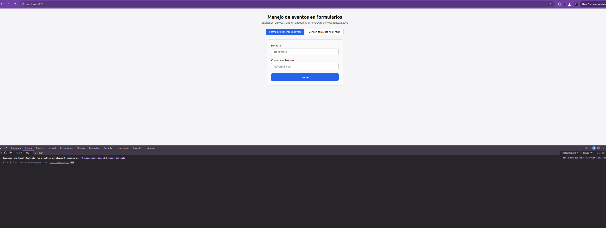
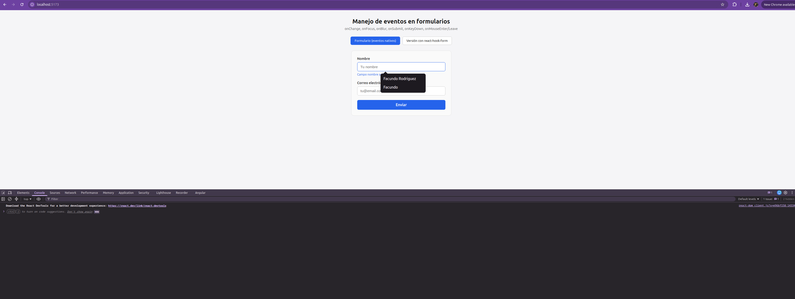
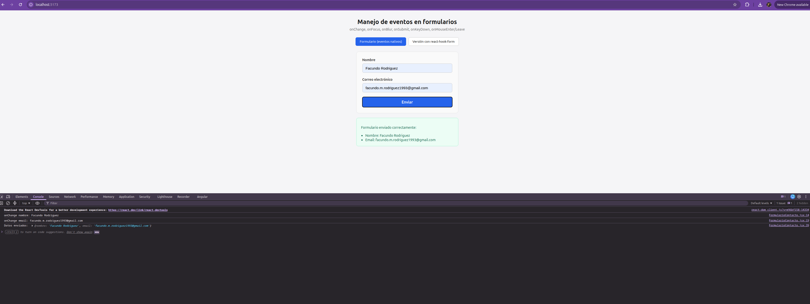

# eventos-react

# 🖱️ Eventos — Manejo de Eventos en Formularios y Componentes

**Curso:** Eventos — Centro de e-Learning UTN BA  
**Módulo:** 2 — Unidad 4  
**Autor:** Facundo Rodriguez

---

## 📸 Capturas de pantalla





---

## 📋 Descripción

Formulario de contacto desarrollado con React (Vite) como entrega del módulo "Eventos".
Implementa un formulario controlado con campos de nombre y correo electrónico, capturando
los eventos `onChange` de ambos campos (registrados en consola) y `onFocus`/`onBlur` para
mostrar un mensaje mientras un campo está activo. El envío se maneja con `onSubmit`,
previniendo el comportamiento por defecto con `preventDefault()` y mostrando los datos
ingresados por consola y en pantalla. Como interacciones adicionales, se detecta la tecla
Enter en el campo nombre con `onKeyDown` y se cambia el estilo del botón de envío al pasar
el mouse usando `onMouseEnter`/`onMouseLeave`. Como extra opcional, se incluye una segunda
versión del mismo formulario reconstruida con **react-hook-form**, alternable desde un tab
en la interfaz, para comparar la diferencia en código y comportamiento frente a la versión
con eventos nativos.

---

## 🚀 Cómo clonar e iniciar el proyecto

```bash
# 1. Clonar el repositorio
git clone https://github.com/FARO1993/modulo-2-tarea-4-utn-fullstack.git

# 2. Ingresar a la carpeta
cd modulo-2-tarea-4-utn-fullstack

# 3. Instalar dependencias
npm install

# 4. Iniciar el servidor de desarrollo
npm run dev
```

Abrí el navegador en `http://localhost:5173` (o el puerto que indique Vite en la terminal).
Abrí también la consola del navegador (F12) para ver los eventos `onChange` y los datos
enviados por `onSubmit`.

---

## 📁 Estructura del proyecto

```
modulo-2-tarea-4-utn-fullstack/
├── index.html
├── package.json
├── vite.config.js
├── .gitignore
└── src/
    ├── main.jsx
    ├── index.css
    ├── App.jsx                        ← tabs para alternar entre las dos versiones
    ├── App.css
    └── components/
        ├── FormularioContacto.jsx     ← formulario con eventos nativos de React
        ├── FormularioContactoRHF.jsx  ← versión opcional con react-hook-form
        └── FormularioContacto.css
```

---

## 🧩 Eventos de React utilizados

| Evento | Uso en el proyecto |
|---|---|
| `onChange` | Actualiza el estado de `nombre` y `email`, registra cada cambio en consola |
| `onFocus` / `onBlur` | Muestra un mensaje mientras el campo nombre o email está activo |
| `onSubmit` | Previene el comportamiento por defecto (`preventDefault()`) y muestra los datos enviados |
| `onKeyDown` | Detecta la tecla Enter en el campo nombre y muestra un mensaje |
| `onMouseEnter` / `onMouseLeave` | Cambia el estilo del botón de envío al pasar el mouse |

---

## 📚 Bibliografía y créditos

**Referencias:**
- Banks, A. y Porcello, E. *Learning React: Modern Patterns for Developing React Apps*. 2ª ed. O'Reilly Media, 2020.
- Freeman, E. y Robson, E. *Head First. JavaScript Programming*. 1ª ed. O'Reilly Media, 2014.
- MDN Web Docs. *DOM events*. Mozilla Corporation. https://developer.mozilla.org/en-US/docs/Web/Events
- React. *Responding to Events*. https://react.dev/learn/responding-to-events
- Anthropic. Claude (modelo de inteligencia artificial). Utilizado como asistente para la generación y revisión del código de este proyecto. https://www.anthropic.com
